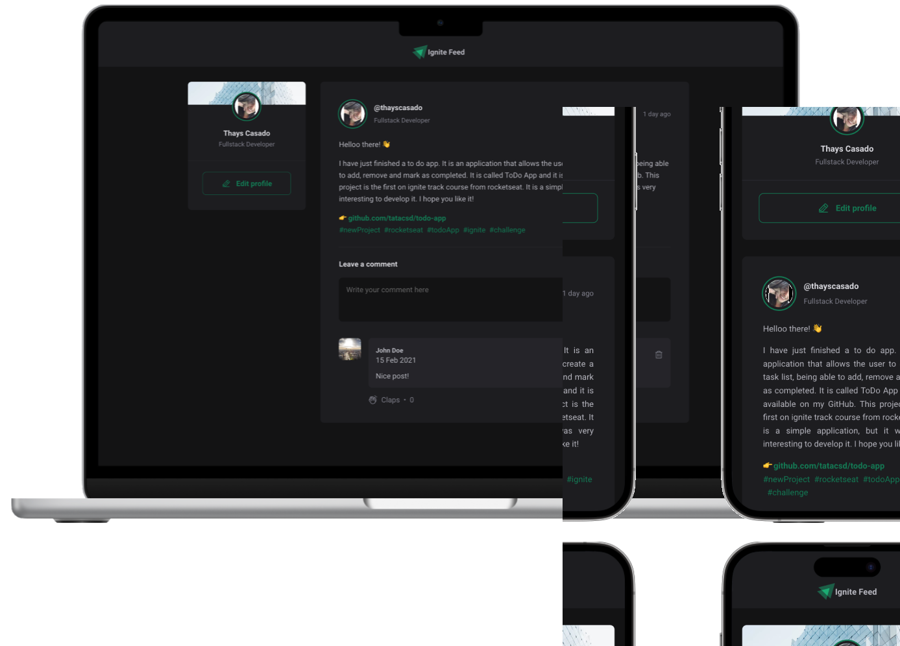

<div align="center" justify="center">
    
    &nbsp;&nbsp;&nbsp;
    <h1>Ignite Feed</h1>
</div>
<br />
<p align="center">
  <a href="#-technologies"> Technologies </a>&nbsp;&nbsp;&nbsp;|&nbsp;&nbsp;&nbsp;
  <a href="#-project"> Project </a>&nbsp;&nbsp;&nbsp;|&nbsp;&nbsp;&nbsp;
  <a href="#-layout">Layout</a>&nbsp;&nbsp;&nbsp;|&nbsp;&nbsp;&nbsp;
  <a href="#-challenge">How to run</a>&nbsp;&nbsp;&nbsp;|&nbsp;&nbsp;&nbsp;
</p>

<div align="center" justify="center">
 
  
  
  <a href="http://www.linkedin.com/in/thayscasado" target="_blank">
  
    </a>
    <a href="https://gofund.me/3265ea9e" target="_blank">
  
  </a>


</div>

<br>

<p align="center">
  
</p>

## 🚀 Technologies

This project was developed using the following technologies:

- [React](https://reactjs.org)
- [TypeScript](https://www.typescriptlang.org/)
- [Vite](https://vitejs.dev/)
- [Uiid](https://www.uuidgenerator.net/)
- [Phosphor react](https://phosphoricons.com/react/)


## 💻 Project

This project is a feed app, where you can add a new post and see the posts of other users. It was developed during the Ignite course, a bootcamp offered by Rocketseat[https://rocketseat.com.br/].

## 🔖 Layout

You can view the project layout through the links below:

- [Layout Web](https://feed-app-xi.vercel.app/)


## 🧠 Challenge

This project was developed during the Ignite course, a bootcamp offered by Rocketseat[https://rocketseat.com.br/]. The goal on creating this project was to practice the concepts of React, Typescript, Vite, Uiid and Phosphor react, on components, props, states, and some hooks, like useState.

We focused on the componentization of the application, creating a Header, a Post, a Post, and Comments components.


## 🚀 How to run

- Clone the repository
```bash
$ git clone git@github.com:tatacsd/feed-app.git
```
- Enter the folder
```bash
$ cd feed-app
```
- Install the dependencies
```bash
$ npm i
```
- Run the application
```bash
$ npm run dev
```
- The application will open on the port:3001 - access http://localhost:3001

You can change the port in the vite.config.ts file.
```ts
export default defineConfig({
  plugins: [react()],
  server: {
    port: 3001,
  }
})
```

